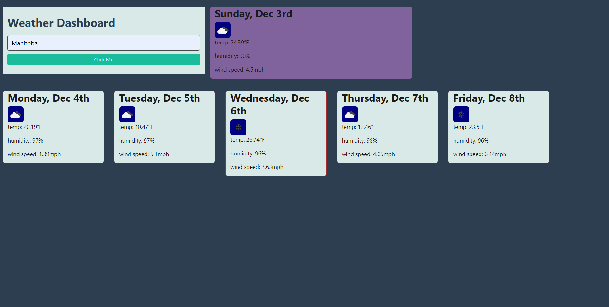

# Weather API website

This website's primary function is to type in a city's name, then the website returns the city's current and future weather for the next 5 days.

## Knowledge
This website required the use of dayjs, as well as the use of a third party api provided by the original assignment. Using bootstrap to make the website look a little more pretty was nice as well, which simply was done in the html. Using numerous fetch requests in the javascript was paramount in making the website truly functional, however.

## Here's what we've got.

A link to the github repository: [https://github.com/cddoigkn/weather_dashboard](https://github.com/cddoigkn/weather_dashboard)

A link to the calendar website: [https://cddoigkn.github.io/weather_dashboard](https://cddoigkn.github.io/weather_dashboard)

